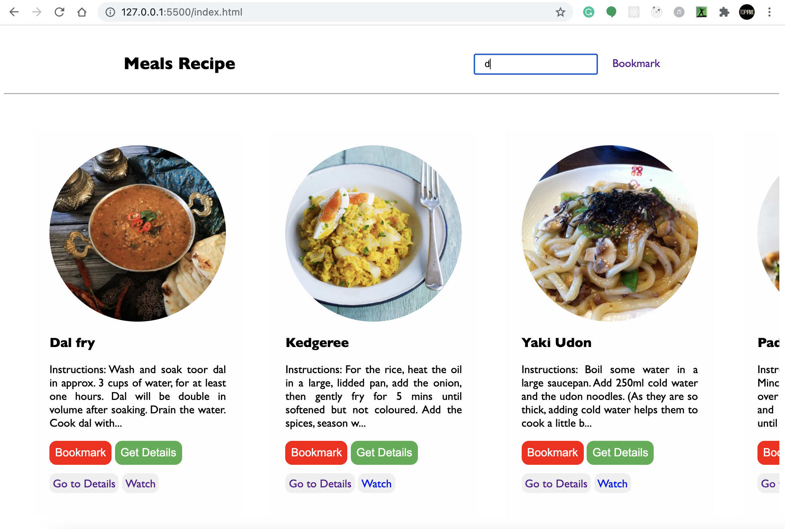
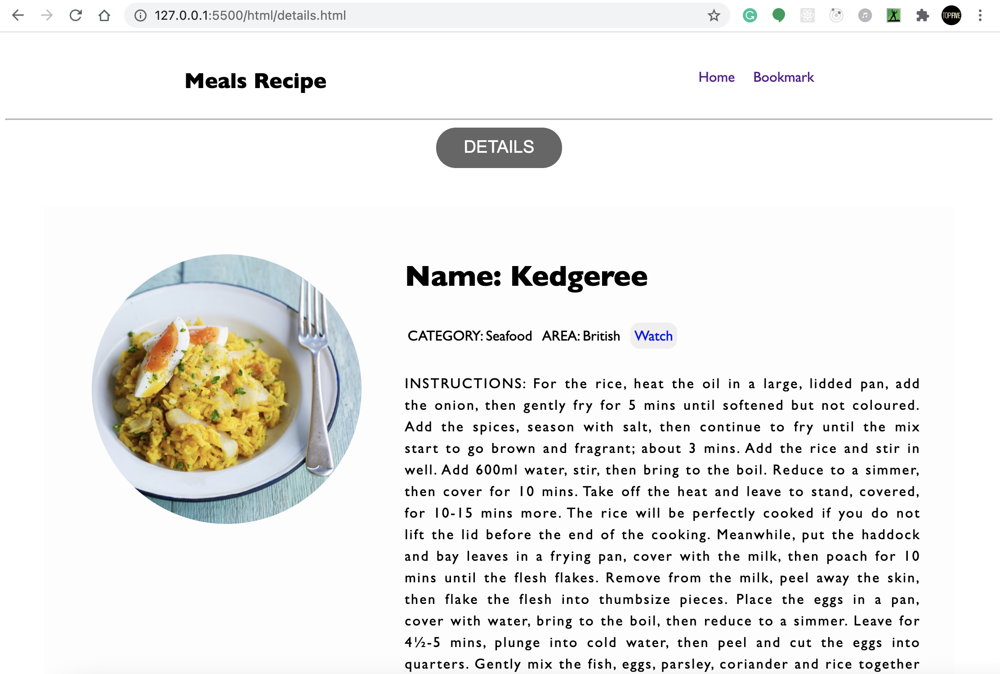
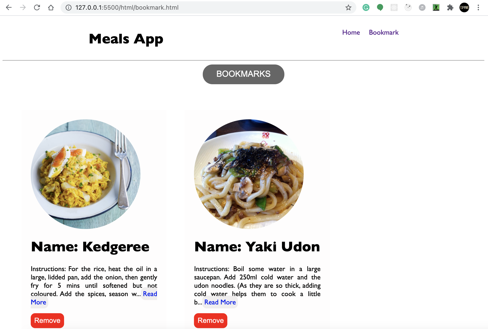

# MEALS APP

It is a solution to the Coding Ninjas CareerCamp Web dev-test2. Please visit the Coding Ninjas career camp website [CodingNinjas CareerCamp](https://careercamp.codingninjas.com/?utm_source=codingninjas&utm_medium=top_navigation&utm_campaign=landing_header) for more details.

## Table of contents

- [Overview](#overview)
  - [Screenshot](#screenshot)
  - [Links](#links)
- [My process](#my-process)
  - [Built with](#built-with)
  - [What I learned](#what-i-learned)
  - [Useful resources](#useful-resources)
- [Author](#author)
- [Acknowledgments](#acknowledgments)

## Overview

It is a meals app where you can search for any meal, displaying the results. You can see the details of every meal item, and you can bookmark and remove the bookmarked meal item.

### Screenshot





### Links

- Live Site URL: [Live Website](https://kurosakicoder.github.io/StopTimerWithThemeChanger/)

## My process

First, I designed the skeleton of the design using HTML and CSS. Then, I started coding in Javascript and also made changes in HTML and CSS.

### Built with

- HTML
- CSS
- JavaScript

### What I learned

I got to learn how to use local storage for saving items

```js
async function getBookmarkData(url) {
  const response = await fetch(url);
  var data = await response.json();
  myObj_serial = JSON.stringify(data.meals);
  for (var i of data.meals) {
    localStorage.setItem(i.idMeal, myObj_serial);
  }
}

async function removeBookmarkData(url) {
  const response = await fetch(url);
  var data = await response.json();
  myObj_serial = JSON.stringify(data);
  for (var i of data.meals) {
    localStorage.removeItem(i.idMeal);
  }
}
```

### Useful resources

- [Window localStorage Property](https://www.w3schools.com/jsreF/prop_win_localstorage.asp)

## Author

- LinkedIn - [Khaidem Sandip Singha ](https://www.linkedin.com/in/khaidemsandip/)
- Twitter - [@KurosakiCoder](https://twitter.com/KurosakiCoder)

## Acknowledgments

I have done this project from scratch by referencing the websites that I mentioned.
